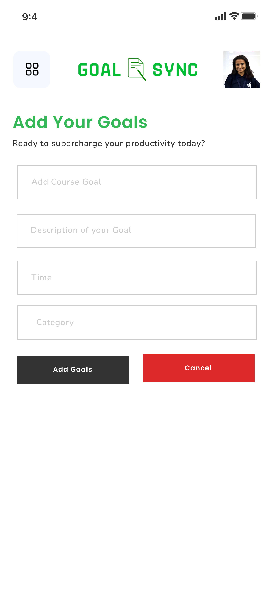

# GoalSync

GoalSync is a simple React Native mobile application designed to help you daily plan your day and boost your productivity. With a seamless and attractive UI design, GoalSync allows you to add and delete goals effortlessly.

## Figma UI Design

#### Figma UI Design Link 
https://www.figma.com/file/2X7B7ycrznsVppGkTQRD1F/GoalSync?type=design&node-id=0%3A1&mode=design&t=8tW2iDelssDJiLlU-1 

## Tech Stack
- React Native
- Expo

## Functionality

#### App Working Video
<video controls src="assets/UI/AppVideo.mp4" title="App Working Video"></video>

This app serves as a basic introduction to React Native, featuring core components such as `View`, `Text`, `Image`, `ScrollView`, `TextInput`, and `TouchableOpacity`. 

#### Key functionalities include:
1. Adding a new goal: Easily add new goals to your daily plan.
2. Deleting a goal: Simply tap on a goal to delete it from your list.
3. Simple and Friendly UI

## Getting Started

To get started with GoalSync:

1. Clone this repository.
2. Install dependencies using `npm install`.
3. Run the app on your preferred platform using `npm run android`.
